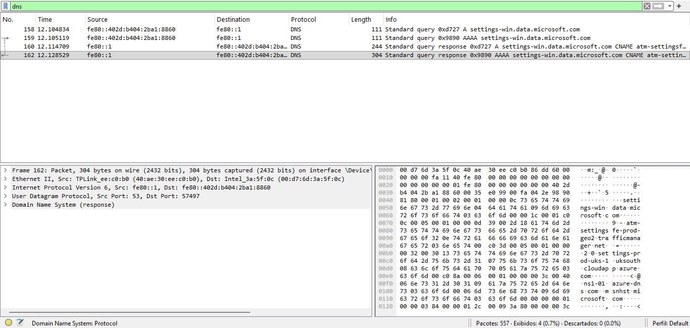
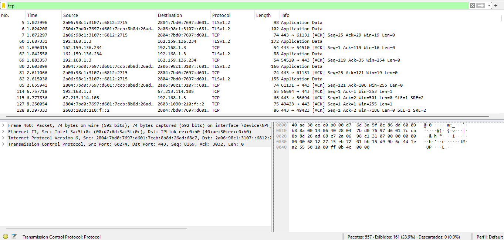

# Network Traffic Analysis – Wireshark Investigation

## Scenario
Network traffic was captured using Wireshark during a short browsing session (~30 seconds) in a local environment. No filters were applied
during capture. Raw traffic was later reviewed for analysis.

## Objective
Understand how encrypted traffic (HTTPS) still exposes behavioral indicators through metadata such as DNS queries, endpoints and
connection patterns.

## Tools Used
- Wireshark
- DNS analysis
- Local operating system traffic capture

## Baseline System Communication
Initial analysis revealed background network activity generated by the operating system, including communication with Microsoft service
endpoints such as settings-win.data.microsoft.com.

### DNS Baseline Communication

Example of background system communication observed during traffic capture:

This type of traffic represents normal baseline behavior and is commonly observed even without direct user interaction. Understanding
baseline communication is essential to distinguish legitimate activity from potential threats.

## Findings
DNS analysis revealed communication with Microsoft service endpoints indicating baseline operating system activity and telemetry.

Even with HTTPS encryption, DNS queries still expose which services the system communicates with. Traffic patterns and external endpoints allow identification of system behavior without decrypting packet contents.

## Encrypted Traffic Analysis
TCP analysis revealed multiple encrypted sessions over port 443 using TLSv1.2 and TLSv1.3.

Connections were established between the local host and external public IP addresses, consistent with standard HTTPS web activity.

Even without decrypting payloads, session patterns, ports, and endpoints provide visibility into network behavior and application usage.

## Analyst Reasoning
Even when payload is encrypted, metadata such as DNS queries, endpoints and session patterns allow identification of system activity.

This mirrors real SOC investigations where analysts rely on traffic behavior, not payload inspection, to understand events.

## Security Implications
- Metadata exposure can reveal system behavior and usage patterns
- Background communication can mask malicious traffic if baseline is unknown
- Monitoring must include DNS and connection analysis

## Mitigation Strategies
- DNS encryption (DoH / DoT)
- Network segmentation
- Egress filtering
- Continuous traffic monitoring
